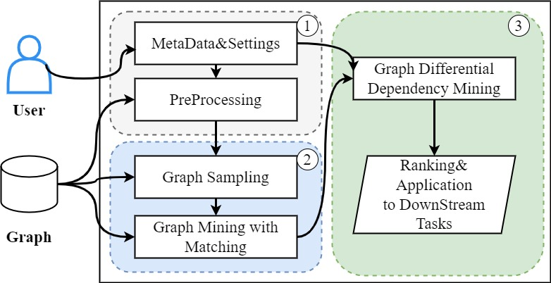

# README
## Discovering Graph Differential Dependencies 
The main objective of this project is to mine graph differential dependencies in graph data and propose an algorithm that can obtain matching record information while mining frequent homomorphic subgraphs, 
Graph differential dependencies provide a primitive form of integrity constraints for specifying the essential parts of data semantics, which plays a key role in entity resolution. And for the mined graph differential dependencies,
we propose a criterion for evaluating their interest level.

## System Requirements
- Java 1.8
- C++17 and GCC 7.x or later
- Python 3

## Python Dependencies
- pandas
- glob
- itertools
- Levenshtein
- multiprocessing

## Compilation
Compile the homomorphic frequent subgraph mining part using `./build.sh` in the `homo_freq_pattern` folder. Run with parameters `./gpmh -d file -t Threshold`.

## Demo
GraphMatching

`cd homo_freq_pattern`

`./build.sh`

run `./gpmh -d /datasets/data.txt -t 4`

Output subgraph matching records separated by -------, displaying the number of subgraphs at the end.
### inputfile:(data.txt)
```
v 0 0
v 1 0
v 2 0
...
v 20 2
e 0 9 0
e 2 9 0
e 1 9 0
e 3 13 0
...
e 15 20 2
```
### outputfile(output.txt)
```
0 9 
1 9 
...
6 15 
8 17 
--------------------------------------------- 
0 9 0 
0 9 1 
...
8 17 5 
8 17 8 
--------------------------------------------- 
0 9 0 10 
0 9 0 11 
...
8 17 5 14 
5 17 8 14 
8 17 8 14 
--------------------------------------------- 
0 9 0 10 0 
0 9 0 10 1 
1 9 0 10 0 
1 9 0 10 1 
2 9 0 10 0 
2 9 0 10 1 
...
8 17 8 14 5 
8 17 8 14 8 
--------------------------------------------- 
--------------------------------------------- 
total subgraph number is  4 
Algorithm execution time: 0.0223419 seconds 

```
GDD Discovering:

`cd GDD`

run `python minGDD.py 1 3 5`

inputfile(produce_Table0.txt)

```
(7356:Taxon0).id;;(7356:Taxon0).name;;(7356:Taxon0).image;;(7356:Taxon1).id;;(7356:Taxon1).name;;(7356:Taxon1).image
1;;Craugastor_pygmaeus;;null;;234895;;Craugastor;;Craugastor%20longirostris.jpg
100045;;Ecleora;;Ecleora%20solieraria.jpg;;214325;;Geometer_moth;;Geometer%20Moth%20Problepsis%20vulgaris.jpg
100047;;Tlepolemus_(genus);;null;;383678;;Longhorn_beetle;;Batus%20barbicornis%20MHNT%20femelle.jpg
10006;;Peridrome;;Peridrome%20orbicularis%2C%20female%20%28Noctuidae%20Aganainae%29.jpg;;393091;;Noctuidae;;Scoliopteryx%20libatrix1.jpg
100070;;Megachile_mlunguziensis;;null;;377999;;Megachile;;Megachile%20lagopoda%201.jpg
100079;;Coleophora_pennella;;Coleophora%20pennella.JPG;;349137;;Coleophora;;Coleophora.striatipennella.-.lindsey.jpg
100088;;Heliophobus;;Dictyestra%20dissectus.jpg;;393091;;Noctuidae;;Scoliopteryx%20libatrix1.jpg
1001;;Euomoea;;null;;214325;;Geometer_moth;;Geometer%20Moth%20Problepsis%20vulgaris.jpg
...
10045;;Falsicingulidae;;null;;102555;;Rissooidea;;P%20antipodarum.jpg
10045;;Falsicingulidae;;null;;366850;;Truncatelloidea;;Antrobia%20culveri.jpg
100451;;Tyloxoles;;null;;383678;;Longhorn_beetle;;Batus%20barbicornis%20MHNT%20femelle.jpg
...
```
outputfile like:
``` 
	Taxon.image=Megachile%20cetera%20f.jpg 0.36;;(7356:Taxon1).image=(7356:Taxon0).image 0.03->(7356:Taxon1).name=(7356:Taxon0).name 0.41 support is 120 0.22789425706472197
	...
	Taxon.image=Megachile%20aethiops%20f2.jpg 0.24;;(7356:Taxon1).image=(7356:Taxon0).image 0.03->(7356:Taxon1).name=(7356:Taxon0).name 0.41 support is 48 0.22789425706472197
	Taxon.image=Megachile%20rhodura.jpg 0.36;;(7356:Taxon1).image=(7356:Taxon0).image 0.03->(7356:Taxon1).name=(7356:Taxon0).name 0.41 support is 108 0.22789425706472197
	Taxon.image=Megachile%20monkmani%20f.jpg 0.36;;(7356:Taxon1).image=(7356:Taxon0).image 0.03->(7356:Taxon1).name=(7356:Taxon0).name 0.41 support is 120 0.22789425706472197
	Taxon.image=Megachile%20clypeata%20f.jpg 0.24;;(7356:Taxon1).image=(7356:Taxon0).image 0.03->(7356:Taxon1).name=(7356:Taxon0).name 0.41 support is 55 0.22789425706472197
	Taxon.image=Megachile%20obtusa%20f.jpg 0.24;;(7356:Taxon1).image=(7356:Taxon0).image 0.03->(7356:Taxon1).name=(7356:Taxon0).name 0.41 support is 57 0.22789425706472197
	;;before: dependency number 14060
	;;after: dependency number 14060
	;;time cost: 998.6029007434845 s
```

## Full Execution Steps
1. **Graph Sampling**: 
   - Run `j2p.py` in `\example\resource`.
   - Paste the result file path into `main.py` in the `sampling` folder. This generates `subgraph.csv`.
   - Place `subgraph.csv` back in the original directory and run `nn2l.py` to get lg graph files in `# t 1` format for graph mining.

2. **Graph Mining**: 
   - Two methods provided: homomorphic frequent subgraph mining and frequent subgraph mining followed by homomorphic subgraph matching.
   - For the first method, use the compiled files from Step 2 to get homomorphic frequent subgraph mining results.
   - For the second method, run `java -jar GraMi_ExactSubgraphMatching-1.0-SNAPSHOT.jar filename=graph.lg datasetFolder=resource/ freq=T`, followed by `java -jar graphflow-0.1.0.jar`.

3. **Generating Pseudo Relationship Tables**: 
   - Run `java -jar TableCreater.jar`.
   - Input data folder: `test/process_2_producer/pre_Table`.
   - Output data folder: `result/`.

4. **Dependency Mining**: 
   - Run `python minGDD.py -c -s -a`, where `c` is confidence, `s` is the number of segments for each attribute, and `a` is the maximum number of attributes for mining.

## Additional Information
- `example\test\process_1_producer` contains `GraphEdges.csv` and `GraphVertices.csv` for the original knowledge graph.
- File formats in `example\test\process_1_producer\purePattern2` should be `(num:NodeType)-[EdgeType]->(Num:NodeType)`.
- The format for `example\test\process_2_producer\pre_Table` should be specified.
- A Yago subset example is provided. To mine graph differential dependencies, run `python minGDD.py -c -s -a` in `example\test\process_3_producer\proTable_meaning`.

## Datasets
The graph datasets used in our paper can be downloaded [here](https://drive.google.com/drive/folders/1VodFmIh5UZ4pShYM58x11iR_aRBD9PZ3?usp=drive_link).

## References
@article{sun2022depth,
  title={An in-depth study of continuous subgraph matching},
  author={Sun, Xibo and Sun, Shixuan and Luo, Qiong and He, Bingsheng},
  journal={Proceedings of the VLDB Endowment},
  volume={15},
  number={7},
  pages={1403--1416},
  year={2022},
  publisher={VLDB Endowment}
}

@article{elseidy2014grami,
  title={Grami: Frequent subgraph and pattern mining in a single large graph},
  author={Elseidy, Mohammed and Abdelhamid, Ehab and Skiadopoulos, Spiros and Kalnis, Panos},
  journal={Proceedings of the VLDB Endowment},
  volume={7},
  number={7},
  pages={517--528},
  year={2014},
  publisher={VLDB Endowment}
}
@inproceedings{vezvaei2022fine,
  title={Fine-Tuning Dependencies with Parameters.},
  author={Vezvaei, Alireza and Golab, Lukasz and Kargar, Mehdi and Srivastava, Divesh and Szlichta, Jaroslaw and Zihayat, Morteza},
  booktitle={EDBT},
  pages={2--393},
  year={2022}
}
